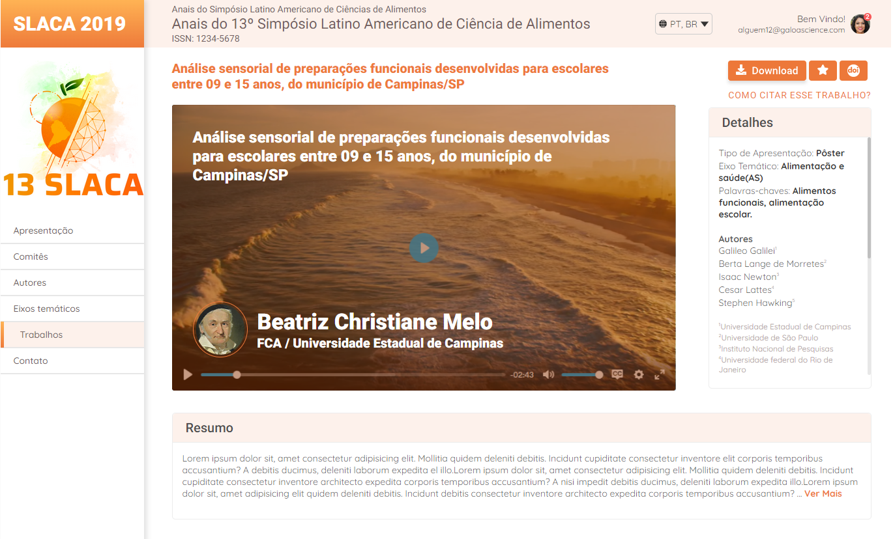
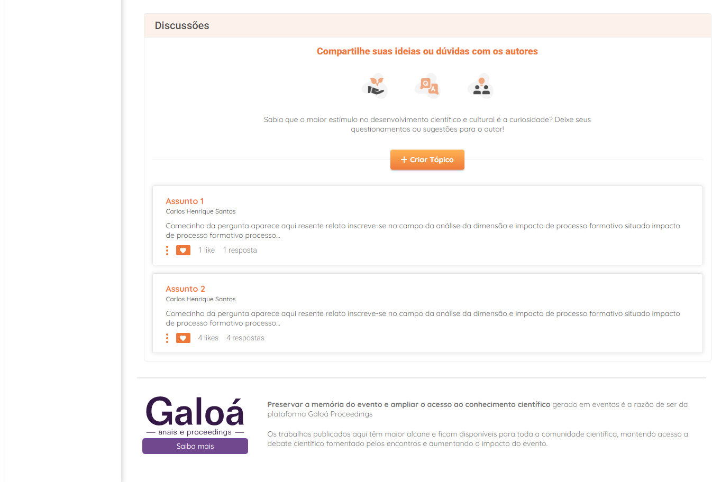

## Projeto criado em um teste avaliativo de uma vaga de estágio.

### Parte inicial do site:

   

### Parte final do site:

   

### Iteração ao clicar no botão "Ver Mais":

   

### Iteração ao clicar no botão "Criar Tópico":

   

### Iteração ao clicar no botão "Enviar":

   

### Iteração ao clicar no botão "Resposta" do último rópico:

   
